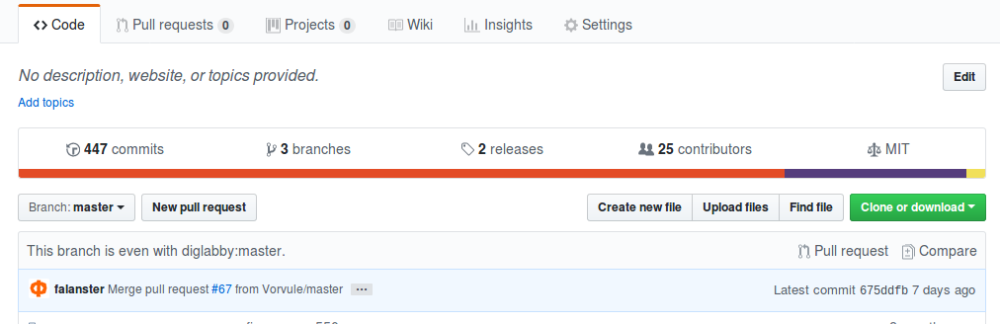

# Landing-page 

## Як ўсталюваць

Спачатку у вашэй сiстэме павiнен быць усталеван git. Калi ен не усталеван, калi ласка усталюйце яго.
Для карыстальнiкау ОС Linux гэта можна зрабiць наступным чынам:
  1. Адчынiце кансоль.
  2. Выканайце у кансолi наступную каманду.

```bash 
sudo yum install git-core - дзеля дiстрiбуцiва Fedora
sudo apt-get install git - дзеля дiстрiбуцiва на Debian
```
Для карыстальнiкау ОС Windows скампуйце файл i усталюйце яго (адсюль](https://desktop.github.com/).


### Каб разгарнўць сайт трэба разгарнуць рэпазіторыі па наступнай чарзе.
1. Адчынiць кансоль, i выканайце наступныя каманды.
2. Спачатку склануйце асноўны рэпазіторый:

Праз камандную строку гэта можна зрабiць наступным чынам.
```bash 
git clone https://github.com/diglabby/diglab_landing_page && cd diglab_landing_page 
```
Альбо зрабiце гэта праз сайт, нацiснувшы зяленую кнопку справа.Яе назва 'clone or download'

 

Калi вы клануеце репазiторый праз сайт вручную, пасля скампавання трэба зрабiць наступнае.
 * Разiрхiвараваць архiв с репазiторыем у патрэбную вам дыректорыю.
 * Зайсцi у разгорнуты репазыторiй `diglab_landing_page`

3. Пасля склануйце модуль ахвараванняў: 

Праз камандную строку гэта можна зрабiць наступным чынам.
```bash 
git clone https://github.com/diglabby/dl_doika-1
```
Альбо зрабiце гэта праз сайт, нацiснувшы зяленую кнопку справа.Яе назва 'clone or download'

 

Калi вы клануеце репазiторый праз сайт вручную, пасля скампавання трэба зрабiць наступнае.
 * Зайсцi у разгорнуты репазыторiй `diglab_landing_page`
 * Разiрхiвараваць архiв с репазiторыем у дыректорыю `diglab_landing_page`.

4. Пасля склануйце модуль чата на старонцы:

Праз камандную строку гэта можна зрабiць наступным чынам.
```bash 
git clone https://github.com/diglabby/chat-widget-for-slack ;
```
Альбо зрабiце гэта праз сайт, нацiснувшы зяленую кнопку справа.Яе назва 'clone or download'

 

Калi вы клануеце репазiторый праз сайт вручную, пасля скампавання трэба зрабiць наступнае.
 * Зайсцi у разгорнуты репазыторiй `diglab_landing_page`
 * Разiрхiвараваць архiв с репазiторыем у дыректорыю `diglab_landing_page`.


5. Пасля склануйце модуль гіт-хаб актыунасцяў: 

Праз камандную строку гэта можна зрабiць наступным чынам.
```bash 
git clone https://github.com/diglabby/github-activity ; 
```
Альбо зрабiце гэта праз сайт, нацiснувшы зяленую кнопку справа.Яе назва 'clone or download'

 

Калi вы клануеце репазiторый праз сайт вручную, пасля скампавання трэба зрабiць наступнае.
 * Зайсцi у разгорнуты репазыторiй `diglab_landing_page`
 * Разiрхiвараваць архiв с репазiторыем у дыректорыю `diglab_landing_page`.


** Важна **
Папкі з модулямі 3,4,5 прапісаць у .gitignore асноўнага рэпазіторыя, каб код не наблытаўся. 
Праз камандную строку гэта можна зрабiць наступным чынам.

```bash 
echo "/github-activity " >> .gitignore 
echo "/dl_doika-1 " >> .gitignore
echo "/chat-widget-for-slack " >> .gitignore
```
Альбо адчынiце файл `.gitignore` у тэкставым редактары, ен знаходзiцца у репазiторыi `diglab_landing_page` i дадайце у яго наступнае.
`
/dl_doika-1
/chat-widget-for-slack 
/github-activity 
`
> Note: Кропка перад назвай файла адзначае что ен зьяуляецца скрытым, запытацйце у гугла як пабачыць усе файлы у вашым файлавым менеджере.


### Aўтаматычнае ўсталюванне

Вы таксама можаце усталюваць усе патрэбныя репазiторыi праз скрыпт аўтаматычнага ўсталювання: **install.sh**.
Дзеля запуска праз скрыпт зрабіць наступнае:

1. Адчыніце консоль у дырэкторыі у якўю будзе разгортвацца праект.

2. Склануйце асноўны рэпазіторый:

```bash 
git clone https://github.com/diglabby/diglab_landing_page && cd diglab_landing_page  
```
3. Калi вы карыстальнiк ОС Linux, выканаце наступную каманду: 

```bash 
chmod -755 install.sh 
```
3. Запусціце скрыпт: 
    
``` 
./install.sh 
```

*Калi вам нешта не зразумела,вы можаце праглядзець наступнае вiдэа на [youtube]()* 

## Праблемы

iнфармацыя дзеля распрацоушчыкау, былi праблемы з пакетам node-sass дзеля модуля чата пры усталюваннi.
